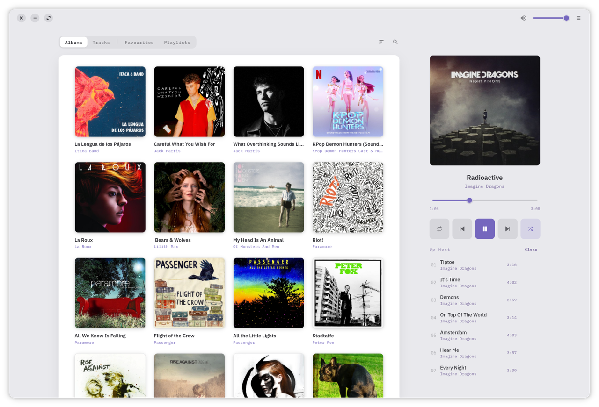
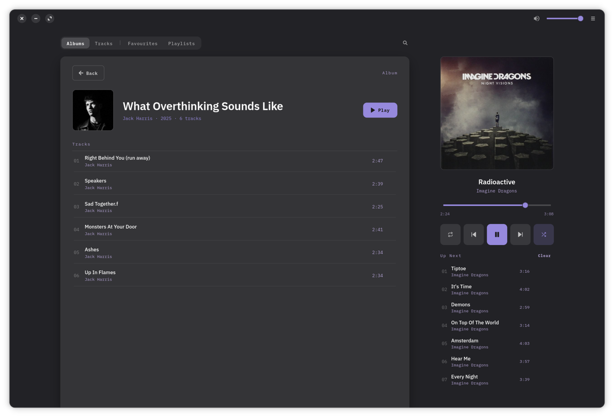
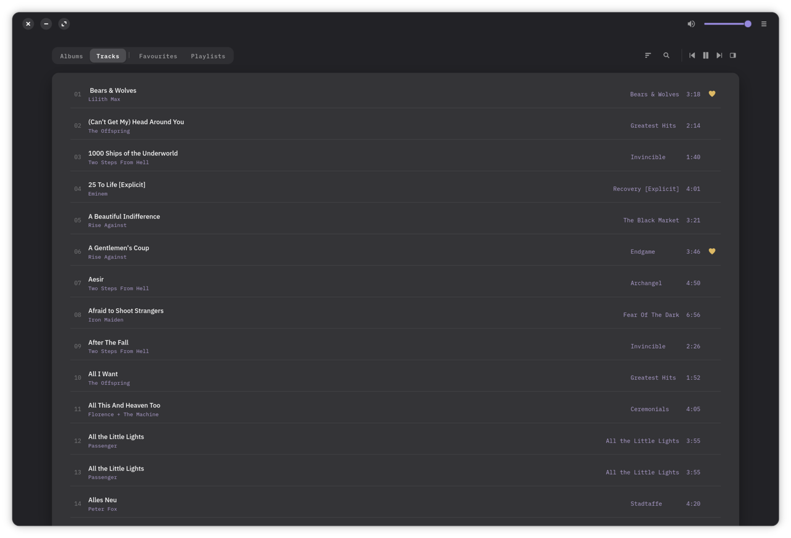

<p align="center">
  
</p>

<h1 align="center">Lyre</h1>

<p align="center">
  A calm, offline music player for GNOME —<br>
  no accounts, no cloud, no noise. Just your library, beautifully laid out.
</p>

<p align="center">
  
</p>

Lyre plays the music you already own. Point it at your folders and it builds a
local library — artists, albums, tracks, favourites and playlists — then gets
the details right: gapless playback, cover art from your own tags, and edits
written back into the files themselves, so your fixes are permanent and
portable.

<p align="center">
  
  
</p>

## Features

**Playback**
- **Gapless playback** with shuffle, repeat and an editable **Up&nbsp;Next** queue
- A **collapsible now-playing panel** that folds away when you want the room
- A **sleep timer** and full keyboard control

**Your library**
- **Albums, Tracks, Favourites and Playlists**, scanned from your folders
- **Cover art from your files' own tags**, with MusicBrainz as a fallback —
  hand-picked images always win
- **Tag editing** for tracks, albums and artist names, written back into the
  files themselves

**Lives on your desktop**
- **Media keys, the sound menu and lock-screen controls** (MPRIS), plus
  track-change notifications — and your screen stays awake while music plays
- **It remembers**: window size, volume, queue, shuffle/repeat and last tab
- **Folder watching**, and light and dark themes that follow the system

## Install

Grab the latest `.flatpak` bundle from the
[**Releases**](https://github.com/DrVonMiau/lyre/releases) page, then install
and run it:

```sh
flatpak install --user io.github.drvonmiau.Lyre.flatpak
flatpak run io.github.drvonmiau.Lyre
```

The first command may offer to pull in the GNOME runtime the app needs — say
yes. You only need [Flatpak](https://flatpak.org/setup/) installed, which most
Linux distributions already have.

## Building from source

Open the project in **GNOME Builder** and press Run — the included Flatpak
manifest (`io.github.drvonmiau.Lyre.json`) takes care of everything, including
the IBM Plex fonts the design uses.

Or with `flatpak-builder` directly:

```sh
flatpak-builder --user --install --force-clean _flatpak io.github.drvonmiau.Lyre.json
flatpak run io.github.drvonmiau.Lyre
```

## Part of a family

Lyre is one of three sibling apps that share a design language — the same calm,
offline-first idea recast for different libraries:

- 🎵 **Lyre** — your music *(you are here)*
- 🖼️ [**Easel**](https://github.com/DrVonMiau/easel) — your photos
- 📖 [**Quill**](https://github.com/DrVonMiau/quill) — your reading

## Built with

GTK4 · libadwaita · PyGObject, packaged as a Flatpak on the GNOME runtime.

## License

Lyre is free software, released under the
[GNU GPL 3.0 or later](COPYING).
